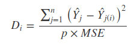

# Dataset of Net hourly wages across multiple countries Mc Donald’s 

## Importing data into R

### Viewing top rows in CSV
```{r}
data <- read.csv("data/BigMac-NetHourlyWage.csv")

head(data,5)
```


## viewing the structure of the dataset 

```{r}
str(data)
```

## Basic Summary stats of dataset

```{r}
summary(data)
```

## seperating numerical and categorical variables from the dataset
```{r}
variable_types <- sapply(data, is.factor) 
numerical_data <- data[,!(variable_types)]
categorical_data <- data[,(variable_types)]

```


# Grapical representaion of the data

## scatter plot for net hourly wages and Big Mac price


```{r,message = F}
library(plotly)
p <- plot_ly(data = numerical_data, x = ~ Big.Mac.Price...., y = ~Net.Hourly.Wage....)
p
```

As price of the BIg Mac increases net hourly wages are also increases, there is a postive relationship between Big Mac prices and Net hourly wages

## Univariate (Box plot) analysis for Outlier analysis

```{r}
p <- plot_ly(type = "box") %>%
  add_boxplot(y = numerical_data$Big.Mac.Price.... , name = "Big Mac price")  %>%
  add_boxplot(y = numerical_data$Net.Hourly.Wage.... , name = "Net hourly wage") 
p
```

we see couple of outliers in the data for Big Mac 

# preprocessing
## extracting the outlier points, rows and removing them
```{r}
outlier_points <- sapply(numerical_data, function(x) boxplot(x,plot=FALSE)$out)
outlier_points
outlier_rows<- which(data$Big.Mac.Price....%in% outlier_points$Big.Mac.Price....)
outlier_rows
data_cleaned <- data[-c(outlier_rows),]
```

There are couple of outliers in Big Mac price and no outliers in net hourly wages

## correlation between BIg Mac and Net Hourly Wage
```{r}
cor(x = data$Big.Mac.Price....,y = data$Net.Hourly.Wage....)
```

correlation between BIg Mac and Net Hourly wage is strong and postively correlated

# Building the regression model
## applying linear regression to the Mac Donald's data
```{r}
model.lm <- lm(Net.Hourly.Wage.... ~ Big.Mac.Price.... ,data = data_cleaned)
summary(model.lm)
```


## viewing diagnostic plots of linear regression
```{r}
par(mfrow=c(2,2))
plot(model.lm)
```
we can observe there is little bit of upword treand in residuals of linear regression model(heteroscedasticity) in 3rd diagnostic graph   

## reengineering model 
### Multivariate model approach for outliers (using cook's distance) and removal of outliers

Cook’s distance is a measure computed with respect to a given regression model and therefore is impacted only by the X variables included in the model. But, what does cook’s distance mean? It computes the influence exerted by each data point (row) on the predicted outcome.

The cook’s distance for each observation i measures the change in Ŷ  (fitted Y) for all observations with and without the presence of observation i, so we know how much the observation i impacted the fitted values. Mathematically, cook’s distance Di for observation i is computed as

```{r pressure, echo=FALSE, fig.cap="Cook's distance formula", out.width = '50%'}

```

where,
<br />
Ŷ j is the value of jth fitted response when all the observations are included.
<br />
Ŷ j(i) is the value of jth fitted response, where the fit does not include observation i.
<br />
MSE is the mean squared error.
<br />
p is the number of coefficients in the regression model

```{r}
cooks.dist<- cooks.distance(model.lm)
plot(cooks.dist, pch="*", cex=2, main="Influential Obs. by Cooks distance",xlab = "observations",ylab = "cook's distance")
abline(h = 4*mean(cooks.dist, na.rm=T), col="red")
text(x=1:length(cooks.dist)+1, y=cooks.dist, labels=ifelse(cooks.dist>4*mean(cooks.dist, na.rm=T),names(cooks.dist),""), col="red")
data_cleaned <- data_cleaned[-c(3),]
```


## Again applying linear regression after removal of outliers

```{r}
model.lm2 <- lm(Net.Hourly.Wage.... ~ Big.Mac.Price.... ,data = data_cleaned)
summary(model.lm2)
```

After removal of outliers we observe p value for big mac price is more significant,adjusted R-squared increased from 36.9 to 55.2 and Multiple R squared increased from 39.5 to 57.1, overall model significance F test p - value becomes more significant.

## viewing diagnostic plots of linear regression
```{r}
par(mfrow=c(2,2))
plot(model.lm2)
```

Now we observe there is no upword trend in residuals (heteroscedasticity) in 3rd diagnostic graph.


